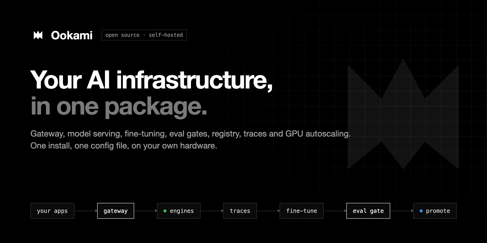
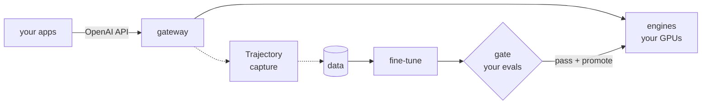

# Ookami



**Open-source, self-hosted AI infrastructure in one package.** Gateway, model serving, fine-tuning, eval gates, model registry, trace capture and GPU autoscaling ship as one install and are driven by one config file. You switch on only what you need. It runs on one GPU box, on any Kubernetes cluster, in your cloud account, or air-gapped.

```yaml
# ookami.yaml: serve an open model on your GPU behind an OpenAI-compatible gateway
apiVersion: ookami.dev/v1alpha1
kind: Platform
metadata: { name: my-box }
spec:
  storage: { uri: ./.ookami }
  components: { training: { enabled: false } }
---
apiVersion: ookami.dev/v1alpha1
kind: Model
metadata: { name: gpt-oss }
spec:
  base: gpt-oss-20b
```

> **Status: 0.3, early.** Verified on Apple silicon (MLX) and NVIDIA (A10G: vLLM + TRL). What works today, on one machine:
> - `ookami init` → `ookami up`: open models on vLLM (NVIDIA), MLX (Apple silicon) or any OpenAI-compatible server, plus API models, behind one gateway with **auth on by default** (keys, budgets, rate limits);
> - `ookami usage`: spend per key or team, API and self-hosted;
> - `ookami train` → gate → `promote`: LoRA fine-tuning gated against the live version by your evaluators, including Inspect and lm-eval;
> - tracing with [Trajectory](https://github.com/KatyarAILabs/trajectory), and a Langfuse trace UI;
> - a web [console](docs/console.md) for models, training, keys, usage and a playground.
>
> Gateway hand-off (shadow/canary/rollback), Kubernetes and GPU efficiency are next. See [docs/plan.md](docs/plan.md).

## Quickstart: fine-tune, gate and serve on one machine

```bash
cd examples/ticket-routing && python make_data.py > tickets.jsonl
ookami train router        # snapshot -> LoRA -> gate vs the base model
ookami promote router      # refused unless the gate passed
ookami up                  # serves the live version behind the gateway on :4000
```

On an M3 Max, `ookami train` took about 6 minutes (Qwen3-4B, 4-bit, 2 epochs). The gate scored the trained version at 82% on held-out rows and 93% on audit rows, against 0% for the base model; the queue codes are made up, so the base can't know them.


## How it fits together



## Components

| Component | Default | Built on |
|---|---|---|
| gateway | managed (or `external`: bring your own) | LiteLLM / Agent Router |
| serving | on | vLLM multi-LoRA, KEDA scale-to-zero |
| training | on | TRL (SFT/DPO), prime-rl (GRPO), Kueue |
| eval | on | Ookami gate + your evaluators |
| registry | on | Postgres + your bucket |
| tracing | off | [Trajectory](https://github.com/KatyarAILabs/trajectory): gateway callbacks → redacted Parquet lake |
| console | off | Ookami's web UI (standard library, no build step) |

## Try it

```bash
uv sync --extra gateway                              # or: pip install 'ookami[gateway]'
# engines are installed separately: pip install vllm (NVIDIA) or pip install mlx-lm (Apple silicon)
uv run ookami up -f examples/serve-only.yaml           # model + gateway on this machine
curl localhost:4000/v1/chat/completions -H 'Content-Type: application/json' \
  -d '{"model": "gpt-oss", "messages": [{"role": "user", "content": "hi"}]}'
uv run ookami down -f examples/serve-only.yaml

uv run ookami validate -f examples/ookami.yaml          # full loop on EKS
uv run ookami validate -f examples/serve-only.yaml     # one GPU box
uv run ookami schema > ookami.schema.json               # editor autocomplete

# Gate two OpenAI-compatible endpoints on your own benchmark:
uv run ookami eval -f examples/benchmark.yaml \
  --candidate openai:http://localhost:8000/v1#my-finetune \
  --incumbent openai:http://localhost:8001/v1#base-model
uv run pytest
```

## Evaluation: you bring the judgement, Ookami brings the statistics

- **Evaluators:**
  - `labels`: a column in your data;
  - `python`: a function decorated with `@evaluator`;
  - `webhook`;
  - `command`: any harness that writes `{"item_id", "score"}` JSONL;
  - `plugin`: evaluators shipped as separate packages through the `ookami.evaluators` entry point;
  - `lm-eval` and `inspect`: planned;
  - `ookami/structural`: JSON and tool-call shape only.
- **What Ookami adds:**
  - frozen held-out and audit splits (duplicates never straddle splits);
  - paired bootstrap confidence intervals per slice;
  - non-inferiority, superiority and threshold tests;
  - a report for every run.
- **Exit codes:** `0` means the gate passed, `3` means it did not pass, `1` means an error. This makes it drop-in for CI.
- **Built-in warnings:**
  - the RL reward is reused as a gate;
  - the gate uses structural checks alone;
  - shadow mode on multi-turn agents with side effects.

```python
from ookami import Score, evaluator

@evaluator(name="task_check", version="2")
def score(example, output) -> Score:
    ok = output["content"].strip() == example.label
    return Score(float(ok), passed=ok)
```

## Documentation

| | |
|---|---|
| [Getting started](docs/getting-started.md) | Install, serve, fine-tune, put live |
| [Architecture](docs/architecture.md) | Components, interfaces, lifecycle, on-disk layout |
| [ookami.yaml reference](docs/reference/ookami-yaml.md) | Every field, generated from the code |
| [CLI](docs/cli.md) · [Serving](docs/serving.md) · [Training](docs/training.md) · [Evaluation](docs/evaluation.md) · [Plugins](docs/plugins.md) | How each part works |
| [Deployment](docs/deployment.md) · [Verification log](docs/verification.md) | Where it runs, what has been tested |
| [Plan](docs/plan.md) | Why Ookami exists, roadmap |

Contributions welcome: see [CONTRIBUTING.md](CONTRIBUTING.md). Licensed under Apache-2.0.
