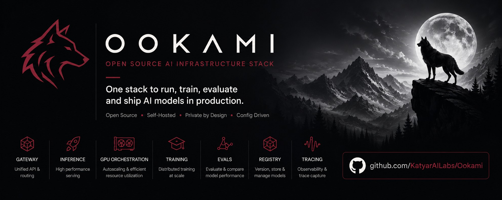
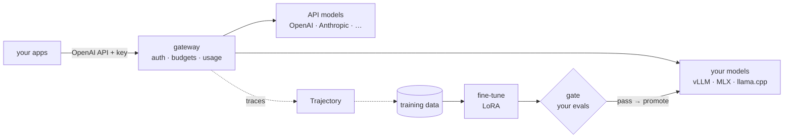

<p align="center"></p>

<p align="center">
  <strong>Run open models and API models behind one secure gateway, fine-tune them on your data,<br>
  and promote a new version only when it beats the live one on your own evals. Self-hosted, one config file.</strong>
</p>

<p align="center">
  <a href="https://github.com/KatyarAILabs/Ookami/actions/workflows/ci.yml"></a>
  <a href="LICENSE"></a>
  
  
</p>

<p align="center">
  <a href="#quickstart">Quickstart</a> ·
  <a href="docs/getting-started.md">Docs</a> ·
  <a href="docs/console.md">Console</a> ·
  <a href="docs/verification.md">What's verified</a> ·
  <a href="docs/plan.md">Roadmap</a>
</p>

---

## Why Ookami

Running open models in production today means stitching together a gateway, an inference server, a fine-tuning stack, eval tooling, a model registry and trace capture, then keeping them all secure and upgraded. The open pieces are excellent but separate. The products that joined them up were acquired, closed, or tied to one cloud or GPU vendor.

Ookami ships those pieces as **one install, driven by one `ookami.yaml`**, on hardware you control:

- **One gateway for everything.** Self-hosted models (vLLM, MLX, llama.cpp) and API models (OpenAI, Anthropic, Bedrock…) sit behind one OpenAI-compatible endpoint. **Auth is on by default**, with per-key budgets and rate limits.
- **Know what it costs.** Spend per key or team, with API cost and self-hosted GPU cost side by side, and cost per million tokens for your own models.
- **Fine-tune on your data.** LoRA on Apple silicon (MLX) or NVIDIA (TRL). A memory planner picks the settings; jobs run one at a time and resume from checkpoints.
- **Promote only what's better.** Every trained version is gated against the live one on frozen held-out and audit splits, with paired bootstrap statistics. **You bring the evaluators**, from labels and Python checks to Inspect, lm-eval, or any benchmark command.
- **Close the loop.** Capture gateway traffic with [Trajectory](https://github.com/KatyarAILabs/trajectory), train on the episodes that went well, and put the result back behind the same gateway.
- **See it all.** A web console for models, versions, training jobs, keys, usage and a playground.

## Quickstart

**macOS, Linux, WSL:**

```bash
curl -fsSL https://raw.githubusercontent.com/KatyarAILabs/Ookami/main/install.sh | sh
```

The installer sets up [uv](https://docs.astral.sh/uv/) if you don't have it, then Ookami with the engine for your machine:

| Machine | Engine it installs |
|---|---|
| Apple silicon | MLX |
| Linux + NVIDIA GPU | vLLM |
| CPU only | none: install llama.cpp yourself (`brew install llama.cpp`) |

Then:

```bash
ookami init               # writes ookami.yaml for this machine
ookami up                 # model + gateway (+ console, if enabled)
export OOKAMI_API_KEY=$(ookami keys master)
curl localhost:4000/v1/chat/completions -H "Authorization: Bearer $OOKAMI_API_KEY" \
  -H 'Content-Type: application/json' -d '{"model": "local", "messages": [{"role": "user", "content": "hi"}]}'
```

On an M3 Max, with the model already downloaded, `init` to the first authenticated reply took **10 seconds**.

<details><summary>Install with pip instead</summary>

```bash
pip install "ookami[gateway] @ git+https://github.com/KatyarAILabs/Ookami.git"
pip install mlx-lm        # Apple silicon;  on NVIDIA: pip install vllm
```
</details>

## Fine-tune, gate and serve in one sitting

The [ticket-routing example](examples/ticket-routing) teaches a model queue codes that a base model can't know:

```bash
cd examples/ticket-routing && python make_data.py > tickets.jsonl
ookami train router       # snapshot → LoRA → gate against the base model
ookami promote router     # refused unless the gate passed
ookami up                 # the trained version, behind the gateway
```

| Hardware | Model | Training | Gate: trained vs base (held-out / audit) |
|---|---|---|---|
| Apple M3 Max (MLX) | Qwen3-4B, 4-bit LoRA | ~5 min | **82% / 93%** vs 0% / 0% |
| NVIDIA A10G (TRL + vLLM) | Qwen2.5-1.5B, 16-bit LoRA | < 1 min | **100% / 100%** vs 0% / 0% |

The gate also *rejects*. On the Mac, an undertrained first version and a version with a serving bug were both blocked, and `ookami promote` refused them.

## Console

<p align="center"></p>

Set `components.console.enabled: true`, or run `ookami console`. Sign in with `ookami keys master`. The console has:
- models and versions, with gate reports, promotion and history;
- training jobs, with live logs;
- keys, budgets, usage and cost;
- a playground.

It's built on the Python standard library with three static files: no build step and no external assets, so it works air-gapped. [More](docs/console.md).

## How it fits together



## What works today

| | Status |
|---|---|
| Gateway: self-hosted + API models, keys, budgets, rate limits, usage and cost | ✅ |
| Serving: vLLM (NVIDIA), MLX (Apple silicon), any OpenAI-compatible server | ✅ |
| Fine-tuning: LoRA with MLX or TRL, memory planner, job queue, checkpoints | ✅ |
| Eval gate: labels, Python, webhook, command, Inspect, lm-eval, plugins | ✅ |
| Registry: versions, gate decisions, promotion rules, audit events | ✅ |
| Tracing via Trajectory; Langfuse trace UI | ✅ |
| Web console | ✅ |
| `ookami init` for Apple silicon, NVIDIA or CPU | ✅ |
| Gateway hand-off: shadow → canary → live, automatic rollback | 🛠 next (0.4) |
| RL (GRPO) | 🛠 0.4 |
| Kubernetes backend: operator, Helm, llm-d, Kueue, free SSO/RBAC | 🛠 0.5 |
| GPU efficiency: scale-to-zero, fractional GPUs, cache-aware routing | 🛠 0.6 |
| MCP gateway, agent sandboxes, guardrails, air-gapped bundle | 🛠 0.7 |

**Verified on real hardware:**
- Apple M3 Max (MLX);
- NVIDIA A10G on AWS (vLLM + TRL);
- a Kubernetes pod on AKS (CPU, llama.cpp).

Every run, including the bugs each one found, is in the [verification log](docs/verification.md). Today everything runs on **one machine**; the Kubernetes backend is next.

## Bring your own evaluators

```python
from ookami import Score, evaluator

@evaluator(name="refund_posted", version="1")
def score(example, output) -> Score:
    ok = output["content"].strip() == example.label
    return Score(float(ok), passed=ok)
```

```yaml
eval:
  evaluators:
    - python: ./evals/refund.py:score
    - inspect: { task: evals/arithmetic.py }
    - lm-eval: { tasks: [gsm8k], limit: 100 }
  gate: { vs: incumbent, test: non-inferiority, margin: -0.01, confidence: 0.95 }
```

**Built-in guardrails:**
- `ookami validate` warns when the RL reward is also a gate evaluator;
- it warns when the gate uses structural checks only;
- reports warn when candidate and incumbent outputs are identical, a sign the trained weights aren't what's being served;
- `ookami eval` exits `3` when the gate fails, so it drops straight into CI.

## Documentation

| | |
|---|---|
| [Getting started](docs/getting-started.md) | Install, serve, fine-tune, put live |
| [Architecture](docs/architecture.md) | Components, interfaces, lifecycle, on-disk layout |
| [ookami.yaml reference](docs/reference/ookami-yaml.md) | Every field, generated from the code |
| [CLI](docs/cli.md) · [Serving](docs/serving.md) · [Training](docs/training.md) · [Evaluation](docs/evaluation.md) · [Plugins](docs/plugins.md) · [Console](docs/console.md) | How each part works |
| [Deployment](docs/deployment.md) · [Verification log](docs/verification.md) | Where it runs, what has been tested |
| [Plan](docs/plan.md) · [Research](docs/research/2026-09-ai-infra-landscape.md) | Why Ookami exists, roadmap, landscape |

## Contributing

Issues and pull requests are welcome; see [CONTRIBUTING.md](CONTRIBUTING.md). The test suite needs no GPU (`uv sync --extra gateway && uv run pytest`). Report security issues privately: see [SECURITY.md](SECURITY.md).

## License

Apache-2.0. Ookami bundles only Apache-2.0, MIT and BSD components.

<p align="center">Built by <a href="https://github.com/KatyarAILabs">Katyar AI Labs</a></p>
