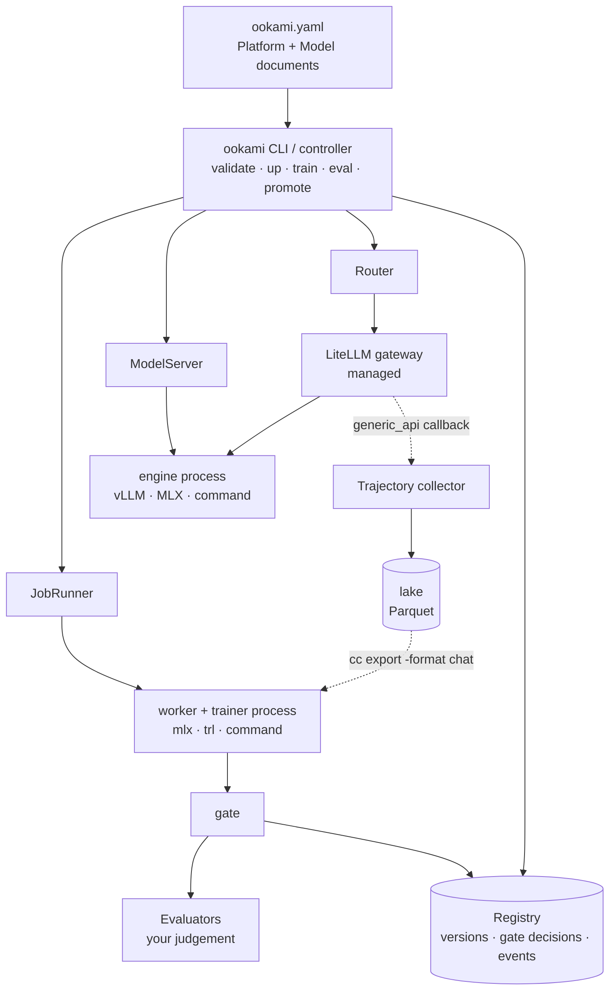
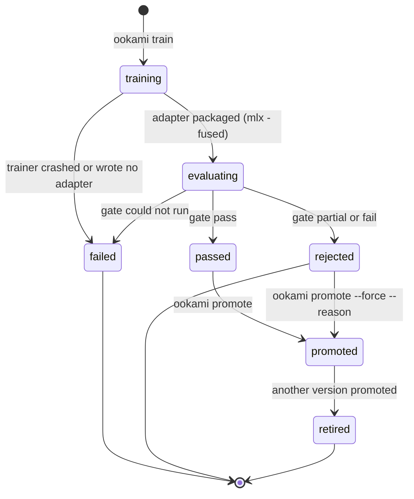
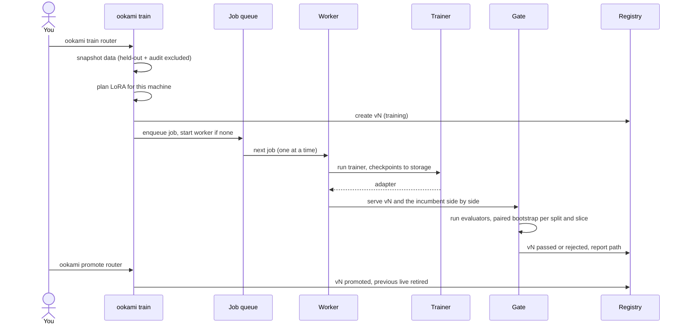

# Architecture

## Overview



- **One config file.** `ookami.yaml` holds two kinds of document:
  - **`Platform`**: one per install. It sets storage, the gateway, which components run, and compute.
  - **`Model`**: one per model. It names the base model to serve and, optionally, data, training, eval and hand-off.
- **One schema.** The Pydantic schema in `src/ookami/config.py` is the only definition of that file. The JSON Schema (`ookami schema`) and the [reference docs](reference/ookami-yaml.md) are generated from it. The Kubernetes CRDs will be too.
- **Backends implement a few narrow interfaces**, so the same config and commands can drive one machine today and Kubernetes or SkyPilot later. Only the `local` backend exists so far.

## Components

| Component | Status | What it does |
|---|---|---|
| gateway | done (managed LiteLLM) | One OpenAI-compatible endpoint that routes each model name to its engine |
| serving | done | One engine process per Model: vLLM (NVIDIA), MLX (Apple silicon) or any OpenAI-compatible server |
| training | done (SFT) | Versioned data snapshots, memory planner, one-job queue, trainers (MLX, TRL, command), checkpoints |
| eval | done | Frozen splits, candidate vs incumbent, paired bootstrap, gate, reports |
| registry | done | Every version with its data hash, config hash, gate decision, report and status; event log |
| tracing | done, via [Trajectory](https://github.com/KatyarAILabs/trajectory) | Ookami runs (or points at) a Trajectory collector and wires the gateway's LiteLLM `generic_api` callback to it. `data.source.traces` trains on the lake through `cc export -format chat` |
| hand-off | planned (0.3) | Shadow, canary, live and rollback at the gateway |
| console | done | Web UI over the registry, jobs, keys and usage, with a playground; standard library only (see [console](console.md)) |

## The four interfaces

| Interface | File | Methods | Implementations |
|---|---|---|---|
| `JobRunner` | `interfaces.py` | `submit`, `status`, `cancel`, `logs` | `train/jobs.py: LocalJobRunner` |
| `ModelServer` | `interfaces.py` | `ensure_base`, `load_adapter`, `unload_adapter`, `adapters`, `healthy` | Local engines in `local/engines.py` (process-based; runtime adapter loading planned) |
| `Router` | `interfaces.py` | `apply(RoutePlan)`, `current`, `rollback` | Planned: LiteLLM router plugin |
| `Evaluator` | `evaluators/base.py` | Row: `score(example, output)`; Rollout: `run(target)` | labels, python, webhook, command, plugin, structural |

**Rule:** anything a backend can't do the same way belongs in the controller, not in the interface.

## Model lifecycle





- **Incumbent:** the version that is live now. If nothing is live, it's the untrained base model.
- **Version statuses:** `training`, `evaluating`, `passed`, `rejected`, `failed`, `promoted` and `retired`. Every change writes an event.

## What lands on disk (local backend)

Everything lives under `Platform.spec.storage.uri`:

```
<storage>/
  registry.db                         SQLite: versions + events
  datasets/<model>/<hash>/            train.jsonl, valid.jsonl, manifest.json (split counts, source hash)
  models/<model>/v<N>/adapter/        LoRA adapter, checkpoints; fused/ for MLX
  jobs/<job_id>/                      job.json, status.json, train.log, mlx.yaml
  jobs/worker.lock                    held by the one running worker
  reports/<model>/eval-<time>.json|md gate reports
  run/state.json                      pids, ports, URLs of running services
  run/gateway.yaml                    generated LiteLLM config
  logs/<service>.log                  engine, gateway and gate-engine logs
```

## Source layout

| Path | Responsibility |
|---|---|
| `config.py` | Schema, loading, cross-document lints |
| `catalog.py` | Known base models: licence, weights per engine, parameter count |
| `data.py` | Loading sources, splits, training snapshots, getting outputs from targets |
| `stats.py` | Paired bootstrap, gate tests |
| `eval_runner.py` | `ookami eval`, reports |
| `evaluators/` | Evaluator SDK, built-ins, plugin loading |
| `local/engines.py` | Engine command lines (vllm, mlx, command) |
| `local/runtime.py` | Process supervision: up, down, status, restart |
| `train/planner.py` | Memory planner |
| `train/backends.py` | Trainer command lines, post-train packaging |
| `train/trl_sft.py` | TRL + PEFT SFT script (NVIDIA) |
| `train/jobs.py` | Job queue, worker, recovery |
| `train/gate.py` | Serving candidate and incumbent for the gate |
| `registry.py` | Versions, promotion rules, events |
| `cli.py` | Commands |

## Design decisions

| Decision | Why |
|---|---|
| Customers bring the evaluators; Ookami never judges correctness | Scores that only measure agreement with the old model reward imitation, not quality. Ookami supplies the statistics and the gate |
| Training needs an eval section | A trained model can only be promoted through the gate |
| One training job at a time | Peak GPU memory stays at one job's size, so hardware and cost stay predictable |
| Hash-based splits per group of identical inputs | A row never changes split as data grows, and a test prompt can't leak into training |
| Serve fused MLX models | mlx-lm 0.31's server ignores `--adapter-path` unless every request names the adapter (see [verification](verification.md)) |
| Few bundled services; bring your own Postgres and bucket in production | Supporting many stateful services on users' clusters is costly |
| Only Apache-2.0 / MIT / BSD dependencies | So security teams can approve the SBOM |
| Tracing is Trajectory, not a Ookami component | Capture, redaction, outcome joins and rewards are a separate open-source project. Ookami runs it and reads its exports rather than duplicating it; the redaction policy stays the user's own Trajectory config |
