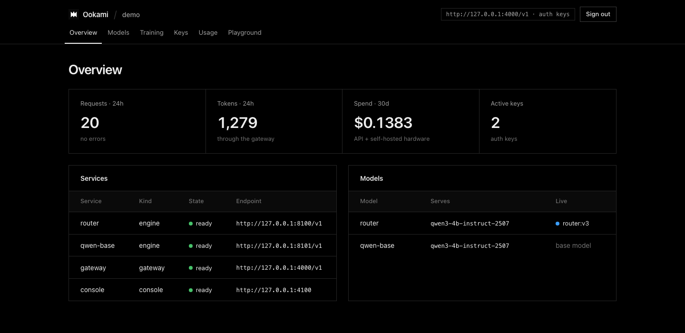
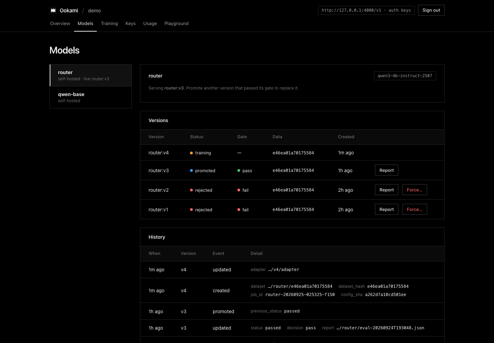
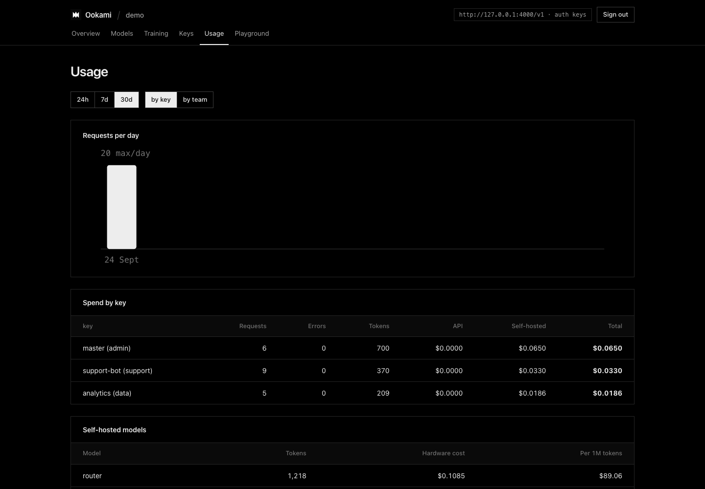

# Console

A web UI over everything Ookami runs: services, models and their versions, training jobs, gateway keys, usage and cost, and a playground.

## Start it

- **With the stack:** set `components.console.enabled: true`, and `ookami up` starts the console next to the gateway. The default address is `http://127.0.0.1:4100` (`Platform.console.port` / `.host`).
- **On its own:** `ookami console` runs it in the foreground.

**Signing in:** use the master key (`ookami keys master`). To sign in with one click, open `http://127.0.0.1:4100/#key=<master key>`. The key is in the URL fragment, so it never reaches the server or its logs, and the page removes it from the address bar immediately.

## Pages

| Page | What you can do |
|---|---|
| Overview | Requests, tokens and errors (24h), spend (30d), active keys; service health; each model's live version |
| Models | Every version with its status, gate decision, data hash and report. **Promote** a version that passed. **Force…** a rejected one, which needs a reason and is recorded. History shows every registry event |
| Training | Start a training job, watch jobs, follow a job's trainer log live |
| Keys | Create keys (shown once), see API spend against budget, revoke |
| Usage | Requests per day; spend per key or team, split into API cost and self-hosted hardware cost; cost per million tokens for each self-hosted model |
| Playground | Chat with any model through the gateway, and see why each reply ended (finished, hit max tokens, tool call). Calls use the master key server-side and show up in Usage |

## Design choices

| Choice | Why |
|---|---|
| Python standard library server + three static files; no framework, no build step, no external assets | Nothing to install, and it works air-gapped |
| Every action goes through the same code as the CLI | Promotion still needs a passing gate or a recorded reason; keys are still stored only as hashes |
| Binds to `127.0.0.1` by default | Put it behind your own proxy and SSO to share it (SSO is planned for 0.5) |
| Strict Content-Security-Policy (`self` only), `X-Frame-Options: DENY`, no inline scripts; all server data escaped before rendering | Stops injected scripts running and the page being framed |
| Monochrome, 1px lines, square corners; colour only in status dots; follows the system light/dark setting | Calm and dense, so status stands out |
