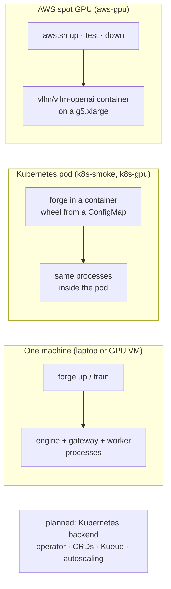

# Deployment

Only the `local` backend exists today. It runs on one machine: a laptop, a GPU VM, or a container. The Kubernetes backend (operator, CRDs, Helm chart, Kueue, GPU autoscaling) is milestone 0.4; see the [plan](plan.md).



## One machine

```bash
pip install 'forge-ml[gateway]'   # plus vllm or mlx-lm, and forge-ml[train-cuda] to train on NVIDIA
forge up -f forge.yaml
```

**What `local` needs:**
- **Storage:** a local path or `file://`.
- **GPU sharing:** nothing coordinates GPU use between serving and training on the same machine. Run training while serving is down, or leave GPU memory headroom with `serve.args` such as `--gpu-memory-utilization`.

## Kubernetes pod, CPU smoke test (`deploy/k8s-smoke/`)

Runs Forge's local backend inside one pod on any cluster:
- llama.cpp serves Qwen2.5-0.5B (GGUF) through `serve.engine: command`, behind the managed LiteLLM gateway;
- a chat call goes through the gateway;
- `forge eval` gates it.

**No container registry needed:** the wheel and the config are mounted from ConfigMaps. See `deploy/k8s-smoke/README.md`.

**The llama.cpp `full` image** keeps its shared libraries next to its binaries, so the pod sets `LD_LIBRARY_PATH=/app`.

## Kubernetes pod on a GPU node (`deploy/k8s-gpu/`)

The full loop (train, gate, promote, serve) on one GPU in a pod. It uses the `vllm/vllm-openai` image and a tainted spot GPU node pool. The README covers adding the pool on AKS, the NVIDIA device plugin, and cleanup. Written but not yet run: see [verification](verification.md).

## AWS spot GPU (`deploy/aws-gpu/`)

```bash
deploy/aws-gpu/aws.sh up       # key pair, SSH-from-your-IP security group, spot g5.xlarge on the Deep Learning AMI
deploy/aws-gpu/aws.sh test     # builds the wheel, copies it over, runs test.sh in vllm/vllm-openai
deploy/aws-gpu/aws.sh down     # terminates the instance, deletes the security group and key pair
```

- **What `test.sh` covers:** validate, vLLM serving, TRL training, the gate with vLLM multi-LoRA, promote, serving the trained version, and four routing calls through the gateway.
- **Tagging:** everything is tagged `project=forge-test`.
- **Permissions:** `iam-policy.json` is the least-privilege IAM policy the kit needs. It can only terminate instances with that tag.
- **Quota:** the account needs at least 4 vCPUs of "All G and VT Spot Instance Requests" quota in the region. New accounts start at 0.
- **Settings:** `REGION`, `TYPE` and `AWS` can be overridden with environment variables.
