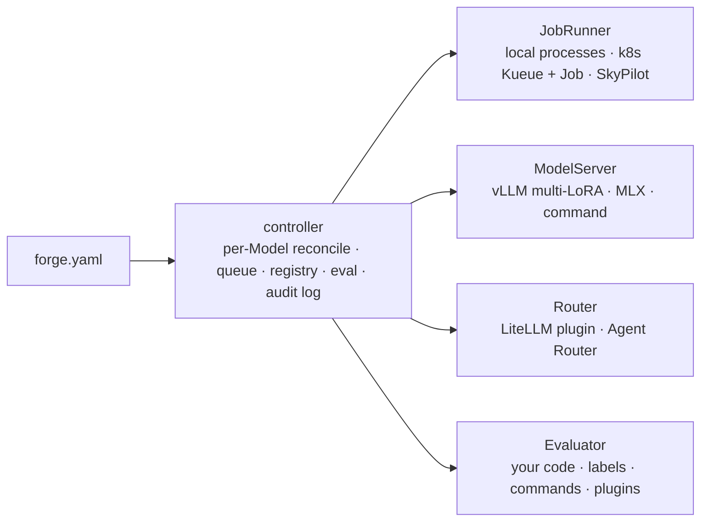

# Forge: plan

2026-09-25 · Working name **Forge**. Pick the real name before the first public release.

## What Forge is

**An open-source, self-hosted AI infrastructure stack in one package.** Running open models in production today means stitching together a gateway, an inference server, GPU autoscaling, a training stack, eval tooling, a model registry and trace capture, then keeping them all upgraded. Forge ships those pieces as one install, driven by one config file. You switch on only the parts you need.

| Component | What it gives you | Built on |
|---|---|---|
| **gateway** | One OpenAI-compatible endpoint in front of every model; routing, fallbacks, shadow and canary traffic | LiteLLM, or Agent Router; `managed`, or `external` for one you already run |
| **serving** | Open models on your GPUs; many LoRA adapters per base; scale to zero | vLLM, KEDA |
| **training** | SFT / DPO / GRPO recipes, a memory planner, a one-job queue, checkpoint/resume on spot GPUs | TRL, prime-rl, Kueue |
| **eval** | Frozen held-out sets, candidate-vs-incumbent statistics, a promotion gate, reports. **You bring the evaluators** | Ours + lm-eval-harness / Inspect / any command |
| **registry** | Every base, adapter, dataset version, eval report and deploy state, with lineage | Postgres + your bucket; MLflow export |
| **tracing** | Captures gateway traffic into your bucket as training data | [Trajectory](https://github.com/KatyarAILabs/trajectory) (separate open-source project); Forge runs it and trains on its exports |
| **console** | A web UI over all of the above | Ours |
| **GPU lifecycle** | On-demand nodes, spot with fallback, budgets | Karpenter / GKE NAP + DWS / AKS NAP, SkyPilot |

**Three ways people use it:**

1. **Serve only:** host an open model on your GPUs behind a gateway (`examples/serve-only.yaml`).
2. **Eval gate only:** compare any two OpenAI-compatible endpoints with your own evals and get a statistical pass/fail (`examples/benchmark.yaml`).
3. **The full loop:** capture traffic, fine-tune, gate, then hand the route over with shadow, canary and live stages, with rollback (`examples/forge.yaml`).

**Where it runs:**
- `local`: one GPU machine;
- `k8s`: EKS, GKE, AKS or on-prem;
- `skypilot`: your cloud account, no Kubernetes;
- air-gapped, from a signed bundle.

**Principles:**
- **Your infrastructure, your data, your weights.** No calls home.
- **One config file** (`forge.yaml`) describes the install. It is also the Kubernetes custom resource, so GitOps works.
- **Composable:** every component works on its own, and `external` mode lets you keep what you already run.
- **Small footprint:** bring your own Postgres and bucket in production; the controller replaces a workflow engine.
- **Licence-clean:** only Apache-2.0, MIT and BSD dependencies, with an SBOM in every release.
- **Forge never judges correctness.** Your evaluators do; Forge supplies the statistics and the gate.

## Why this is needed (Sep 2026)

- **Every end-to-end self-hosted option was acquired or deprecated:**
  - Adaptive ML went to Datadog (Jun 2026);
  - OpenPipe went to CoreWeave;
  - Predibase went to Rubrik;
  - Parsed went to Baseten;
  - NVIDIA's Data Flywheel Blueprint was deprecated (Apr 2026).
- **The open pieces are excellent but separate:**
  - vLLM for serving;
  - LiteLLM as the gateway;
  - TRL, Oumi, ART and prime-rl for training;
  - Kueue and Kubeflow Trainer for scheduling;
  - lm-eval and Inspect for evaluation.
- **Nobody ships them as one install with one config, or wires them into a loop.**
- **Closest options and their limits:**
  - NVIDIA NeMo Helix: tied to NVIDIA;
  - Red Hat OpenShift AI: tied to OpenShift;
  - Adaptive ML: closed, and now part of Datadog.

## The config

```yaml
apiVersion: forge.dev/v1alpha1
kind: Platform            # one per install: components, storage, gateway, compute
metadata: { name: acme }
spec:
  backend: local          # local | k8s | skypilot
  storage: { uri: ./.forge }
  gateway: { mode: managed }            # managed | external (url) | none
  components:
    training: { enabled: false }        # serving, eval, registry on by default; tracing, console off
---
apiVersion: forge.dev/v1alpha1
kind: Model               # one per model: serve a base; optionally data + train + eval + handoff
metadata: { name: gpt-oss }
spec:
  base: gpt-oss-20b
```

Full reference: `examples/forge.yaml`. JSON Schema: `forge schema`.

**Rules:**
- Unknown keys are errors.
- Secrets are always `${secret:name}` references.
- A model that is trained must have an eval section, so it can only be promoted through the gate.
- A Model that needs a component the Platform has turned off fails validation.

## Evaluation

**Forge owns the machinery. You own the judgement.** This followed a council review on 24 Sep 2026.

- **Evaluators you bring** (or install as plugins, via the `forge.evaluators` entry point):
  - a labels column;
  - a Python function (`@evaluator`);
  - a webhook;
  - any `command` that writes per-item scores (agent simulators, internal test suites);
  - lm-eval-harness and Inspect (planned).
- **Built in:**
  - frozen held-out and audit splits, hash-based per group of identical inputs, so a test prompt never leaks into training;
  - paired bootstrap confidence intervals **per slice**;
  - non-inferiority, superiority and threshold tests;
  - `minItems`;
  - reports saved to storage.
  - `structural` (JSON, tool name and argument validity) is labelled "shape only".
- **Guardrails:**
  - Forge ships no "agrees with the incumbent" or built-in LLM-judge gate, because those measure imitation, not quality.
  - `validate` warns when the RL reward is also a gate evaluator (reward hacking the gate goes unseen), and when a gate uses structural checks alone.
  - Shadow mode is valid only for single-turn or read-only routes, unless you plug in a `shadowExecutor`.
- **Deferred until there is real traffic:** sequential canary testing and implicit signals (retry rate, tool errors).

## Architecture



- **Controller:** Python with Kopf on Kubernetes. The same reconcile code runs in `local` mode without Kubernetes.
- **Model lifecycle:** Collecting → Ready → Queued → Training → Evaluating → (gate) → Shadow → Canary → Live, with Rollback.

## Packaging

| Channel | For |
|---|---|
| `pip install forge-ml` / Homebrew | CLI, SDK, local backend |
| OCI Helm chart + operator (`forge install`) | Any Kubernetes cluster |
| Zarf bundle (`forge bundle`): images, charts, base weights as OCI artefacts (CNCF ModelPack), SBOM, cosign signatures | Air-gapped sites |
| `forge upgrade` | Migrations and CRD conversion through the operator |

## Milestones

| Version | Ships | Exit test |
|---|---|---|
| **0.0.1 (done)** | `forge.yaml` schema, `validate`, `schema`, backend interfaces, Evaluator SDK, `forge eval` + gate + reports, 42 tests | `forge eval` gives the correct pass/fail on recorded results and on a live command |
| **0.1: one GPU box (done, except registry)** | `forge up` / `status` / `logs` / `down`; engines vllm, mlx, command; managed LiteLLM gateway (`forge-ml[gateway]`); evaluator plugins via entry points. Verified on Apple silicon (MLX + LiteLLM); vLLM path not yet run on a GPU | `pip install forge-ml && forge up -f examples/serve-only.yaml` serves gpt-oss-20b behind the gateway on a fresh machine |
| **0.2: train + gate (done)** | JSONL/Parquet/HF ingest and versioned snapshots; memory planner; `train_sft` on mlx, trl or a command; one-job queue with checkpoint/resume; automatic gate vs the live version; registry with gated `promote`; `forge up` serves the live version | Verified on Apple silicon: a 4B model trained, was rejected when broken, passed when fixed (82% vs 0% held out), and served through the gateway. The TRL path is not yet run on a GPU. Promotion restarts the engine; runtime adapter hot-load moves to 0.4 |
| **0.3: secure by default, first 5 minutes** | Gateway auth on by default (generated master key, per-team virtual keys, budgets, rate limits); cost attribution across API providers and self-hosted GPU time; closed-API providers routed next to self-hosted models; `forge init` + one-command install (`uvx forge up`); Inspect and lm-eval evaluators; Trajectory → Langfuse wiring for a trace UI; the NVIDIA path verified on a GPU | A fresh machine reaches its first authenticated OpenAI-compatible call in about 5 minutes; per-key spend is visible for both API and self-hosted calls |
| **0.4: hand-off** | LiteLLM router plugin: shadow, canary, live, automatic rollback, gated by the same evaluators; runtime LoRA loading on vLLM without restart; `train_rl` (GRPO via verl, agent RL over the Trajectory lake via SkyRL or ART) | A route moves from an API model to the fine-tuned model and rolls back automatically on a metric drop |
| **0.5: Kubernetes** | Operator + CRDs from the same schema, OCI Helm chart, llm-d serving, Kueue + KEDA + GPU Operator + DRA, Karpenter on cloud, external Postgres/S3, `doctor`, `upgrade`; **SSO (OIDC), RBAC, teams and quotas in the free edition** | Clean EKS, GKE and on-prem installs in < 30 min; one config file moves from the laptop to the cluster unchanged |
| **0.6: GPU efficiency** | Scale-to-zero with gateway fallback; fractional GPUs (HAMi or KAI); multi-LoRA density; KV/prefix-aware routing through llm-d; published, reproducible benchmarks for gateway overhead, throughput and cold start | Measurably higher GPU utilisation than a plain vLLM deployment on the same traffic |
| **0.7: agents and regulated sites** | MCP gateway (ContextForge), sandboxes (k8s agent-sandbox + gVisor), guardrails (Presidio + NeMo Guardrails); Zarf + ModelPack air-gap bundle, cosign/SBOM gate; SkyPilot backend; console | Air-gapped install on a disconnected k3s VM; an agent's tool calls run sandboxed and are captured by Trajectory |

The order follows the [research](research/2026-09-ai-infra-landscape.md):
- **Table stakes first:** auth, cost and the first five minutes.
- **Then the part only Forge has:** the loop with gateway hand-off.
- **Then scale:** Kubernetes and GPU efficiency.
- **Then agents and regulated sites.**

## Open decisions

1. The name. `forge` collides with Minecraft Forge and Atlassian Forge.
2. Governance: a foundation-neutral repo from day one, or a company-owned repo first.
3. Whether anything is ever paid (hosted console, support, LTS builds) or it stays fully open.

## Risks

| Risk | Mitigation |
|---|---|
| Scope: "all AI infra" is huge | Ship components in order of demand (serve, then eval gate, then train, then hand-off). `external` mode lets users keep what they have |
| Supporting user clusters is costly (PostHog dropped Helm installs over this) | Few dependencies; external Postgres/S3; `doctor` and `debug dump` |
| Upstream churn (RL libraries are pre-1.0) | Our own `train_*` interface; pinned versions; our eval suite on every upgrade |
| NVIDIA NeMo Helix becomes the default | Stay GPU-, cloud- and gateway-neutral; smaller install |
| vLLM runtime LoRA loading is for trusted environments | Internal network only; only the controller calls it |

## Sources

**Market (checked 2026-09-24):**
- Datadog acquires Adaptive ML: https://www.datadoghq.com/blog/datadog-acquires-adaptive-ml/
- NVIDIA Data Flywheel Blueprint (deprecated): https://github.com/NVIDIA-AI-Blueprints/data-flywheel
- NeMo Helix release notes: https://docs.nvidia.com/nemo-helix/documentation/reference/release-notes/current-release/
- Baseten acquires Parsed: https://www.theinformation.com/newsletters/ai-agenda/inference-provider-baseten-acquires-reinforcement-learning-startup-parsed
- Oumi: https://github.com/oumi-ai/oumi
- OpenShift AI Training Hub: https://developers.redhat.com/articles/2026/03/26/scale-llm-fine-tuning-training-hub-and-openshift-ai

**Packaging:**
- W&B operator: https://docs.wandb.ai/guides/hosting/operator/
- PostHog sunsetting Helm support: https://posthog.com/blog/sunsetting-helm-support-posthog
- Airbyte abctl: https://docs.airbyte.com/platform/deploying-airbyte/abctl
- Zarf: https://github.com/zarf-dev/zarf
- Distr: https://github.com/distr-sh/distr
- Kubeflow Trainer v2: https://blog.kubeflow.org/trainer/intro/
- Kopf: https://github.com/nolar/kopf
- CNCF ModelPack: https://github.com/modelpack/model-spec
- KServe OCI storage: https://kserve.github.io/website/docs/model-serving/storage/providers/oci
