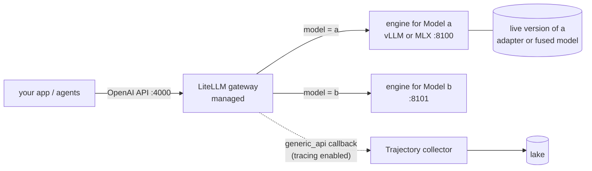

# Serving

## What `ookami up` starts



Start order: the collector first (if managed), then engines, then the gateway. If anything fails to start, everything already started is stopped.

## Engines

Each Model runs as one OpenAI-compatible server process. `serve.engine` picks the engine:

| Engine | When | Command Ookami builds | Model id clients send |
|---|---|---|---|
| `auto` (default) | `mlx` on Apple silicon, `vllm` when `nvidia-smi` exists | - | - |
| `vllm` | NVIDIA | `vllm serve <weights> --served-model-name <name>`, plus `--enable-lora --lora-modules <name>=<adapter>` for a trained version | The Model name |
| `mlx` | Apple silicon | `mlx_lm.server --model <weights or fused model>` | `default_model` |
| `command` | Anything else | Your `serve.command`, with `{weights} {port} {host} {name} {adapter}` filled in | `serve.modelId`, or the Model name |

Extra flags go in `serve.args`, e.g. `[--max-model-len, "8192"]`.

**Which weights are served:**
- `weights:` when you set it;
- otherwise the catalog's entry for `base` (`src/ookami/catalog.py`);
- on Apple silicon, pre-converted MLX weights when the catalog has them.

## Gateway

The gateway is set by `gateway.mode`:

| Mode | What happens |
|---|---|
| `managed` (default) | Ookami writes `run/gateway.yaml` and starts LiteLLM on `gateway.port` (default 4000). Each Model name is routed to its engine |
| `external` | Ookami writes `run/gateway-models.yaml` for you to add to your own gateway |
| `none` | No gateway; call engines directly |

- **Where LiteLLM comes from:** the managed gateway needs `ookami[gateway]`. Ookami prefers the LiteLLM installed next to itself over one on `PATH`. A LiteLLM installed without its proxy extras fails to start, and Ookami's error says so.
- **Stable model ids:** clients send the same model id before and after a new version goes live, so the gateway config doesn't change on promotion.

## Keys, budgets and rate limits

The managed gateway requires a key by default (`gateway.auth: keys`):

```bash
ookami keys master                                   # admin key, generated on first use
ookami keys create alice --team research --budget 50 --rpm 120   # shown once; stored only as a hash
ookami keys list                                     # team, state, spend this month
ookami keys revoke alice
```

**How it works:**

| Part | Behaviour |
|---|---|
| Keys | Stored as SHA-256 hashes in `<storage>/registry.db`. No Postgres needed |
| Master key | In `<storage>/secrets/master_key` (mode 0600) |
| The check | A LiteLLM custom-auth hook decides each call: missing, unknown or revoked key → 401; over `--rpm` in a sliding minute → 429; monthly provider spend at or over `--budget` → 429 (`budget_exceeded`) |
| Health endpoints | Stay open |
| `gateway.auth: none` | Turns it off; `ookami validate` warns |

Callers send `Authorization: Bearer <key>`. Ookami's own eval runner, and the harnesses it runs, send `OOKAMI_API_KEY`.

## Usage and cost

Every call is recorded: key, team, model, tokens, provider cost and latency. `ookami usage [--by team] [--since 7d]` reports spend per key or team:

| Column | Where it comes from |
|---|---|
| API $ | Provider cost as LiteLLM prices it |
| Self-hosted $ | Each engine's hardware cost for the period (`serve.costPerHour` × uptime), split across keys by their share of that model's tokens |
| Per-model line | Self-hosted cost per million tokens, to compare with API prices |

## API models next to self-hosted ones

```yaml
kind: Model
metadata: { name: gpt }
spec:
  provider: { name: openai, model: gpt-5-mini, apiKey: "${secret:OPENAI_API_KEY}" }
```

- **What it is:** any LiteLLM provider (`openai`, `anthropic`, `azure`, `bedrock`, `vertex_ai`, ...) routed through the same gateway, with the same keys, budgets and usage.
- **Secrets:** `${secret:NAME}` reads environment variable `NAME` on the local backend.
- **Not trainable:** API models can't be trained. Set `base:` to fine-tune an open model.

## Trace UI with Langfuse

```yaml
kind: Platform
spec:
  observability:
    langfuse: { host: "http://langfuse.internal:3000", publicKey: "${secret:LANGFUSE_PUBLIC_KEY}", secretKey: "${secret:LANGFUSE_SECRET_KEY}" }
```

- **What happens:** the gateway sends every call to Langfuse over OpenTelemetry, through LiteLLM's `langfuse_otel` callback.
- **Install:** needs `ookami[observability]`.
- **If Langfuse is down:** calls still succeed.
- **How it relates to Trajectory:** Langfuse is for people browsing traces; Trajectory (below) is for training data. They run side by side.

## Tracing with Trajectory

With `components.tracing` enabled and `Platform.tracing` set:
- **Managed collector:** `ookami up` first starts the collector (`cc run -config <tracing.config>`, `mode: managed`) and waits for `tracing.healthUrl`.
- **Gateway wiring:** the managed gateway is given `litellm_settings.callbacks: [generic_api]` and `GENERIC_LOGGER_ENDPOINT=<tracing.webhook>`. With `tracing.tokenEnv`, it also gets a bearer header read from that environment variable.
- **External gateway:** add the same two settings to your own LiteLLM.

**What clients should send** for runs to be grouped well (from Trajectory's LiteLLM guide):
- `litellm_session_id`, one per agent run;
- `metadata.task_type`;
- `metadata.episode_end: true` on the last call.

The collector config, including its redaction policy, is yours: Ookami doesn't generate it.

## Serving trained versions

- **What gets served:** `ookami up` serves each Model's **live** (promoted) version. With nothing promoted, it serves the base model.
- **After a promotion:** `ookami promote` restarts that Model's engine if it's running. Loading adapters at runtime, without a restart, is planned for vLLM.
- **vLLM:** the adapter is served as a LoRA module on the base model.
- **MLX:** training ends by **fusing** the adapter into `adapter/fused/`, and that fused model is what's served. mlx-lm 0.31's server ignores `--adapter-path` unless each request also names the adapter, so fusing is the reliable way. See [verification](verification.md).
- **command:** your template must contain `{adapter}`.

## Process supervision (local backend)

- **Background processes:** services run in the background, each in its own process group. Their pids, ports, URLs and logs are recorded in `<storage>/run/state.json`.
- **Health checks:** engines are ready when `GET /v1/models` returns 200. The gateway is ready when `GET /health/liveliness` returns 200.
- **Failed starts:** if any service exits while starting, Ookami stops everything it launched, removes the state, and prints the last log lines.
