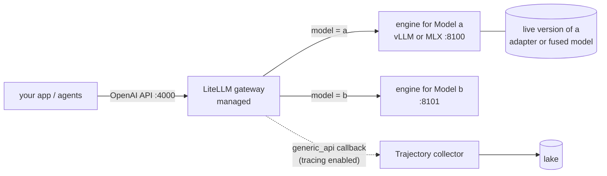

# Serving

## What `forge up` starts

Start order: the collector first (if managed), then engines, then the gateway. If anything fails to start, everything already started is stopped.

## Engines

Each Model runs as one OpenAI-compatible server process. `serve.engine` picks the engine:

| Engine | When | Command Forge builds | Model id clients send |
|---|---|---|---|
| `auto` (default) | `mlx` on Apple silicon, `vllm` when `nvidia-smi` exists | - | - |
| `vllm` | NVIDIA | `vllm serve <weights> --served-model-name <name>`, plus `--enable-lora --lora-modules <name>=<adapter>` for a trained version | The Model name |
| `mlx` | Apple silicon | `mlx_lm.server --model <weights or fused model>` | `default_model` |
| `command` | Anything else | Your `serve.command`, with `{weights} {port} {host} {name} {adapter}` filled in | `serve.modelId`, or the Model name |

Extra flags go in `serve.args`, e.g. `[--max-model-len, "8192"]`.

**Which weights are served:**
- `weights:` when you set it;
- otherwise the catalog's entry for `base` (`src/forge/catalog.py`);
- on Apple silicon, pre-converted MLX weights when the catalog has them.

## Gateway

The gateway is set by `gateway.mode`:

| Mode | What happens |
|---|---|
| `managed` (default) | Forge writes `run/gateway.yaml` and starts LiteLLM on `gateway.port` (default 4000). Each Model name is routed to its engine |
| `external` | Forge writes `run/gateway-models.yaml` for you to add to your own gateway |
| `none` | No gateway; call engines directly |

- **Where LiteLLM comes from:** the managed gateway needs `forge-ml[gateway]`. Forge prefers the LiteLLM installed next to itself over one on `PATH`. A LiteLLM installed without its proxy extras fails to start, and Forge's error says so.
- **Stable model ids:** clients send the same model id before and after a new version goes live, so the gateway config doesn't change on promotion.

## Tracing with Trajectory

With `components.tracing` enabled and `Platform.tracing` set:
- **Managed collector:** `forge up` first starts the collector (`cc run -config <tracing.config>`, `mode: managed`) and waits for `tracing.healthUrl`.
- **Gateway wiring:** the managed gateway is given `litellm_settings.callbacks: [generic_api]` and `GENERIC_LOGGER_ENDPOINT=<tracing.webhook>`. With `tracing.tokenEnv`, it also gets a bearer header read from that environment variable.
- **External gateway:** add the same two settings to your own LiteLLM.

**What clients should send** for runs to be grouped well (from Trajectory's LiteLLM guide):
- `litellm_session_id`, one per agent run;
- `metadata.task_type`;
- `metadata.episode_end: true` on the last call.

The collector config, including its redaction policy, is yours: Forge doesn't generate it.

## Serving trained versions

- **What gets served:** `forge up` serves each Model's **live** (promoted) version. With nothing promoted, it serves the base model.
- **After a promotion:** `forge promote` restarts that Model's engine if it's running. Loading adapters at runtime, without a restart, is planned for vLLM.
- **vLLM:** the adapter is served as a LoRA module on the base model.
- **MLX:** training ends by **fusing** the adapter into `adapter/fused/`, and that fused model is what's served. mlx-lm 0.31's server ignores `--adapter-path` unless each request also names the adapter, so fusing is the reliable way. See [verification](verification.md).
- **command:** your template must contain `{adapter}`.

## Process supervision (local backend)

- **Background processes:** services run in the background, each in its own process group. Their pids, ports, URLs and logs are recorded in `<storage>/run/state.json`.
- **Health checks:** engines are ready when `GET /v1/models` returns 200. The gateway is ready when `GET /health/liveliness` returns 200.
- **Failed starts:** if any service exits while starting, Forge stops everything it launched, removes the state, and prints the last log lines.
